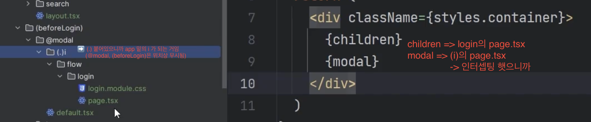
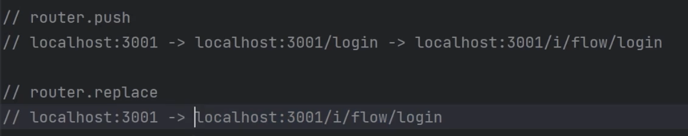

## 섹션 1. 기획자와 디자이너가 기획서를 던져주었다.

- 레이아웃: 페이지를 바꿔도 안 바뀌는 부분 (레이아웃은 리렌더링 x, 페이지만 렌더링됨)

- **RootLayout**: 최상위 레이아웃
  => 이 안에 있는 {children}에 app - page.tsx가 들어가는 것~
  => 모든 페이지에 적용됨
  -> 만약 얘를 안 쓰고싶은 페이지가 있다면? 해당되는 그 폴더 안에 layout 따로 만들깅~

- 다이나믹 라우팅: `[]`안에 바뀌는 값 넣어서 폴더 만들면 됨 `ex) [id]`

- page.tsx => 화면 그잡채

//

- app 아래 `()`: 주소창의 주소 변경 없이 그룹화 기능 수행 `ex) 폴더구조: app - (afterLogin) - home => 주소: app/home`
  -> 그룹 폴더 (그룹화 시킴)
  -> () 아래에도 layout 만들 수 있음
  => () 아래에 있는 파일/폴더들에 전부 레이아웃 적용됨

//

- 레이아웃 기준으로 폴더 구조 잡기~~

- `template.tsx`: 페이지 바뀌면 리렌더링됨 (레이아웃과 반대됨, 한 폴더에 둘 다 쓰면 안 되고 둘 중 하나 선택해서 써야함)

- `<Link href="~">`: 넥스트에서 `<a>`태그 대신 사용하는 링크 태그
  -> a 태그는 페이지가 새로고침 하면서 넘어가기 때문 ㅠㅠ

- `redirect(url:"~")`: 서버에서 동작하는 페이지 리다이렉트, import {redirect} from "next/navigation"; 로 선언 필요함
  -> 인터셉팅 라우트는 동작 안 함 (인터셉팅은 클라이언트 컴포넌트임)

- 넥스트에서는 png를 import해서 쓸 수 있음 -> import pngName from "../../public/pngName.png";
  => 사용할 때는 `<Image src={pngName} alt="png" />` 이렇게 씀
  => 넥스트가 이미지를 알아서 최적화해줌

//

- css module -> import styles from "./page.module.css";
  => 후보군 1. Styled Component / emotion: SSR이라 안 돌아감
  후보군 2. vanilla extract: windows에서 문제가 있음
  후보군 3. css module: 간편해서 선택함
  -> `className={styles.name} => .name{}으로 사용, 한 파일에서 한번에 스타일링 가능`
  => 스타일링 파일 이름에 module 껴있으면 className 이름 겹쳐도 알아서 해당 폴더/페이지/레이아웃 찾아서 스타일링 가능
  => `global.css`은 module 안 껴있으니까 전역적 사용 가능

- `dvw`, `dvh`: 새로 나온 단위, flex 후 화면 채우기에 적합~ (모바일의 주소창 여부에도 영향을 안 받아서 화면 안 틀어짐)
  -> `flex: 1` 같은 거 쓰면 개꿀

//

- `Parallel Routes`: 주소는 바꾸면서 전의 화면(pages.tsx)은 유지하면서 모달창을 띄우는 것 (한 페이지에서 화면 2개를 동시에 보여주는 것)
  -> 유지하려는 폴더가 포함된 상위 폴더에서 `@modal` 이라는 폴더 만든 후 필요한 주소창 주소 구조 안에 pages.tsx 생성 (이때 평행하려는 두 페이지의 폴더가 다르면 안 됨 (상위 폴더가 같아야함 !))
  => 동시에 보여주려는 페이지(배경)의 layout에서 modal 사용~

- `default.tsx`: 페러렐 라우트에 대한 기본값 (페러렐 라우트를 사용하기 전 / 사용되지 않을 때의 기본값)

- 페러렐 라우트 여러 개면? 그냥 여러 개 만들면 됨 ㅇㅇ (default도 같이~~)

//

- 넥스트의 컴포넌트들(.tsx, ...) => 서버 컴포넌트
  -> 서버 컴포넌트: Next.js 서버에서 돌고 있음 (리액트 18 버전에서 추가된 기능)
  -> use State/Ref, ...등 Hook을 못 씀
  => 필요한 경우 클라이언트 컴포넌트라고 명시해줘야함

- "use client": 파일 맨 위에 적어주면 클라이언트 컴포넌트됨, 해당 파일은 서버에서도 렌더링 되기 때문에 SSR도 됨

//

- `Intercepting Routes`: 폴더명 앞에 `()`를 붙이면 `같은 폴더명이지만 () 안 붙은 애` 부분을 가로채서 인터셉팅 라우트 부분의 내용을 실행함
  -> `(..)`: 주소 기준으로 부모 폴더로 올라감 (@, () 등은 주소창에 없으니까 여기서도 무시됨)
  -> `(.)`: 주소 기준으로 현재 폴더 (@, () 등이 있으면 걔는 무시하고, 걔 자리에 현재 폴더를 둔다고 생각해야함)

- 인터셉팅 라우트로 **()붙은 폴더** 만든 뒤에도 **원본 폴더 (() 안 붙은 애)** 계속 놔둬야함
  -> 새로고침 / 주소 쳐서 접근 / 브라우저 통해 처음 실행될 때에는 **원본**이 실행되기 떄문
  -> `() 붙은 애`는 링크로 타고 넘어갈 때 실행됨 !! (가로채는 거니깡)
  -> `() 붙은 애`랑 `안 붙은 애` 내용은 보통 똑같음 (꼭 안 똑같아도 되긴 함, 보통은 뒷배경으로 쓰니까..?)
  => 가로채기가 발생하는 상황 / 발생하지 않는 상황 구분 필수

> 
> -> 여기서 (i)가 modal에 그려지는 이유는 인터셉팅 라우트이자 페러렐 라우트여서, 페러렐 라우트 부분(modal)에 그려지는 것~
> -> 오타: login의 page 아니고 (beforeLogin)의 page임,,

- 페러렐 라우트 + 인터셉팅 라우트 => 둘이 동시에 사용하면, **기존 화면** 위에 **페러렐 라우트이자 인터셉팅 라우트인 것**을 띄울 수 있음

//

- private folder(\_폴더): 폴더 정리용, 공통된 내용의 폴더들을 모아둠 -> 이 폴더명도 주소창에 안 뜸
  -> 안에 `componentName`으로 공통 내용 넣어두고, 그 내용이 필요한 곳 page에 `<componentName />` 으로 쓰면 됨

//

- `서버 컴포넌트` ->import-> `클라이언트 컴포넌트` (O)
  -> `클라이언트 컴포넌트` ->import-> `서버 컴포넌트` (X) : 서버가 클라이언트로 바뀌어버림

- `useRouter()`: 클라이언트 페이지 라우팅하는 Hook, "use client"; + import {useRouter} from "next/navigation" 선언 필요
  ex) const router: AppRouterInstance = useRouter()
  -> 이때 replace 말고 push 쓸 떄도 있음 (둘의 차이는 뒤로가기 했을 때 나타남)
  => replace는 주소를 대체하는 거니까 중간 히스토리가 삭제됨 / push는 그대로 있음
  
