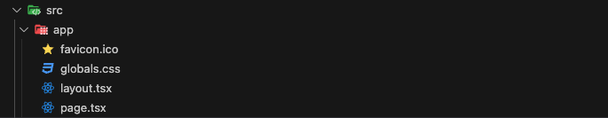
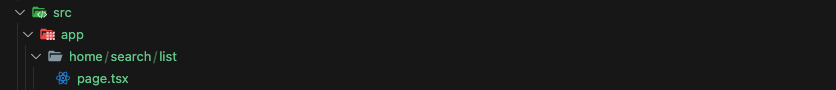
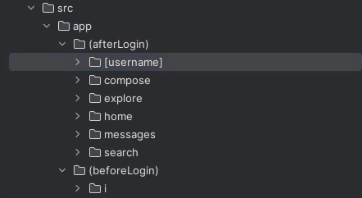
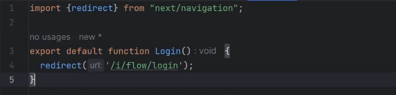
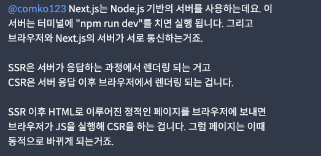
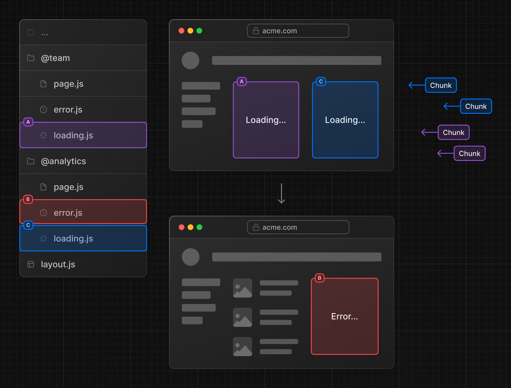
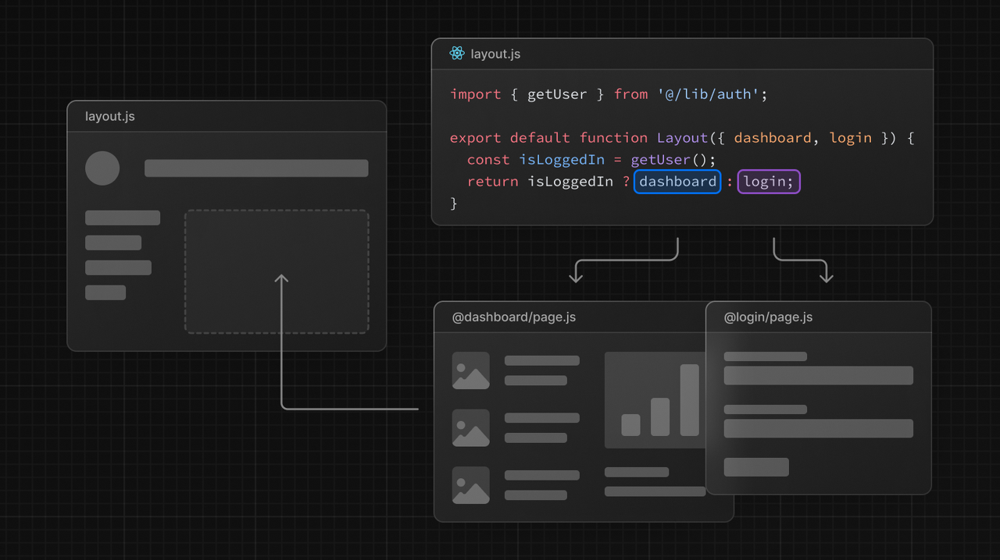

# App Route

Next.js 에서는 routes의 경로를 일일히 지정하지 않고 **파일 디렉토리 구조를 통해 routes를 구현**함

<br>

---

### 최상단 App 폴더

<br>

보통 src 폴더 내부에 존재하는 app 폴더로 **route 구조의 최상단 페이지**를 의미함

( React의 main 혹은 app 파일과 동일한 위치 )

app 폴더는 “/” 경로에 해당함



<br>

---

### 폴더 내부

<br>

- **page.tsx**
  특정 폴더 내부에 page.tsx 파일의 페이지 컴포넌트가 존재한다면 해당 폴더는 하나의 라우트 구조가됨

  ```tsx
  // /home/search/list

  // home 폴더
  //   - search 폴더
  //        - list 폴더 내부 page.tsx
  ```

  
  **즉! 폴드 내부의 page.tsx 파일이 존재한다면 그 폴더는 경로 폴더가 되어짐**

  <br>

  ***

  <br>

- **layout.tsx**

  💡 경로간에 공유되어지는 공간

  <br>

  ***

  <br>

- **Root layout.tsx**

  💡 app 폴더, 즉 최상위 루트 디렉토리에 존재하는 **최상위 레이아웃**

  내부에 `html`과 `body`가 존재함

  <br>

  ***

  <br>

> **`/home` 폴더의 page를 접속한다면**
>
> `root layout.tsx` ⇒ `home layout.tsx` ⇒ `home page.tsx` 순으로 접속되게됨

<br>

---

<br>

> **🔥 Page가 변경되면?**
>
> page가 변경되어지더라도 상위의 layout들은 리 렌더링되지 않음

<br>

---

<br>

- **template.tsx**

  💡 바로 위에서 언급한 내부 page가 변경되어도
  layout.tsx의 리렌더링이 일어나지 않는 상황을 해결하고 싶을때 사용 가능함

  layout.tsx와 동일하지만 내부 page가 변경되었을 경우 template.tsx는 리렌더링이 발생함

  **🔥 한 폴더 내부에 layout.tsx 와 template.tsx는 공존할 수 없음**

  <br>

---

### Router Group

💡 위 사진과 같이 ( ) 괄호의 이름으로 폴더를 만들고
그 안에 특정 라우트들을 담아 라우터를 그룹지을 수 있음



Router Group 내부에는 **특정 Group만을 위한 layout.tsx**을 만들 수 있음

( 위 사진의 경우 로그인 후에는 nav가 보여야하고 로그인 전에는 nav가 보여지지않는다면

로그인 후 Group 내부 layout에 nav를 정의해주면 됨 )

<br>

---

<br>

### Not-found Page

💡 app 폴더 내부 **not-found.tsx** 생성

<br>

---

### Dynamic Routes

💡 기존 React Route 에서 “**/경로/:id”** 와 동일한 역할

폴더의 구조에서 **[id]** 와 같은 이름으로 폴더를 생성하고 내부에 **page.tsx** 컴포넌트를 통해 동작 가능

```tsx
// 경로 폴더
//    [id] 폴더
//        page.tsx

const IDComponent = (props) => {
  console.log(props);
  return <h1>{props.params.id}</h1>;
};

export default IDComponent;
```

이후 위 예시와 같이 props 내부의 params를 통해 값을 가져올 수 있음

만약 주소에 **“/about-me/14121512512?key=thisIsKey&location=대전”** 와 같이 입력한다면

```tsx
{ params: { id: '14121512512' },searchParams: { key: 'thisIsKey', location: '대전' }}
```

위와 같은 props를 전달받게됨

<br>

---

### Redirect

<aside>
💡 특정 페이지로 redirect 시킬때 사용되어짐

</aside>



- 주의 사항

  - 추후 Intercepting Route를 사용할 경우 redirect를 사용하면 정상적으로 동작하지 않음

  <br>

---

## use client

상단에 “use client”를 적는것으로 해당 컴포넌트와 그 하위 컴포넌트가 CSR 로 동작함

하지만 use client 를 사용한다고 client 에서만 렌더링 되는것이 아님

backend 에서 render 되고 frontend 에서 hydrated 됨을 뜻함

- server component는 “use client” 를 사용하지 않은 모든 컴포넌트가
  기본으로 server로 적용됨
  그리고 server에서 먼저 render 되어지고 hydrated 되지 않음

  <br>

---

## hydration

💡 단순한 HTML 파일을 React application로 초기화 하는 작업

- 사용자가 페이지에 진입하면 React가 적용되지 않은 HTML이 전달되어짐
- 이후 진입하자마자 React application을 초기화하는 작업을 시작함
- 이후 HTML 파일을 컴포넌트로 변환하고 이벤트 리스너를 부착하여 React DOM 에서 관리하게됨
- 해당 과정을 Hydration 이라고함



- **navbar 와 같은 공통적으로 적용될 컴포넌트의 경우**

<br>

<br>

<br>

<br>

<br>

# Parallel Routes - 병렬 라우트

<br>

💡 **병렬 라우팅 ( parallel Routing )**

조건에따라 하나 이상의 페이지를 렌더링할 수 있도록 해줌

- 추가로 Modal에 사용할 수 도 있음

<br>

### 사용 규칙


폴더 네이밍에서 `@`**를 앞에 붙여줌**으로 사용할 수 있음


위의 예시와 같이 사용시 app 폴더의 `layout.tsx` 파일내부에서

아래의 예시와 같이 해당 패러럴 폴더 내부의 page.tsx에 접근할 수 있음.

```tsx
export default function Layout({
  children,
  team, // @team
  analytics, // @analytics
}: {
  children: React.ReactNode;
  analytics: React.ReactNode;
  team: React.ReactNode;
}) {
  return (
    <>
      {children}
      {team}
      {analytics}
    </>
  );
}
```

<br>

### 장점

- 병렬 라우팅을 통해 각 독립된 폴더로 구분되어 **각각의 라우트 별로 error 및 loading 상태를 관리**할 수 있음
  
  A,B 독립된 로딩처리로 B에서 Error가 발생하더라도 A는 문제없이 보여짐
- **인증 상태에따라 쉽게 다른 렌더링상태를 제공**할 수 있음
  

<br>

### default.tsx

💡 페이지에서 동일한 구조의 라우트( 슬롯 )가 존재하지 않는 경우 `default.tsx`가 대체되어 렌더링됨


해당 예시에서 `/settings` url로 이동시

`@team` 폴더 내부에는 settings 폴더와 내부 page.tsx가 존재하여 문제없이 렌더링됨

하지만 `@analytics` 폴더 내부에는 settings 폴더가 존재하지 않아 에러가 발생해버림

이런 경우 default.tsx가 @analytics 내부에 존재한다면

**존재하지 않는 경로에 접근시 default.tsx가 대체**되어 나타남

<br>

<br>

<br>

<br>

<br>

# Intercepting Routes

<br>

💡 경로를 가로챌때 사용할 수 있음

<br>

예시로 feed 라는 페이지 내부에서 특정 photo를 클릭시 Modal이 동작해야함

이런 경우 아래 사진과 같이 경로를 Intercepting Routes를 설정하고 photo 링크에 접근시

`/photo/123` 를 가로채고 `/feed` 위에 모달이 뛰어지도록 보여줌


url 이 /photo/123 으로 변경되었지만 뒷 배경은 그대로 feed

<br>

**🔥 but**

**만약 Link 태그로의 접근이 아닌 `/photo/123` 경로를 다이렉트 혹은 새로고침 한다면?**

가로채지 못하고 `(..)photo` 폴더가 아닌 `photo 폴더`의 page.tsx를 보여주게됨

<br>

### 사용 규칙

가로채고자하는 동일한 폴더의 이름앞에 `(.)` 등을 붙여 사용함

- `(.)`
  **동일한 수준** 의 세그먼트를 일치시킬때
- `(..)`
  **한 수준 위의** 세그먼트와 일치시킬때
- `(..)(..)`
  **두 수준 위의** 세그먼트와 일치시킬때
- `(...)`**루트** `app`
  디렉터리 의 세그먼트를 일치시킬때


위 photo 폴더에 접근시 (..)photo 폴더가 가로챔

<br>

### 주의 사항

intercept Route의 경우 server 가 아닌 client에서 관장함
