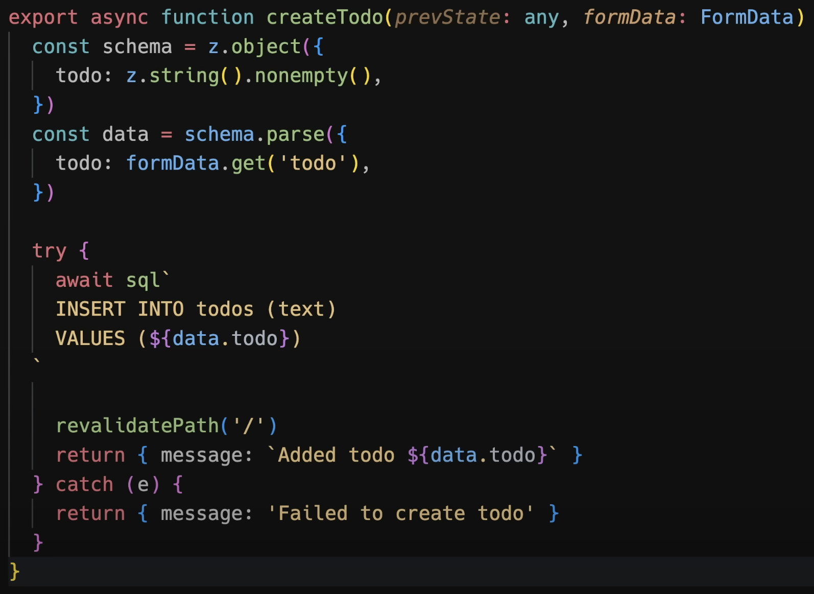

[🔗 Next.js Server Action](https://nextjs.org/docs/app/building-your-application/data-fetching/server-actions-and-mutations)

## Server Action

서버 액션이란, 서버 상에서 **폼 제출**과 **데이터 뮤테이션을 처리**하기 위해 사용되는 비동기 함수이다.

## Usage

**서버 컴포넌트**에서는 특정 함수 내에 ‘use server’을 명시하는 **인라인 함수 방식**, 파일 최상단에 명시하는 **모듈 방식** 모두 사용 가능하다.

**클라이언트 컴포넌트**에서는 파일 최상단에 ‘use server’가 명시된 파일을 Import 해오는 **모듈 방식** 서버 액션만 가져와 사용할 수 있다 (인라인 함수 방식은 불가!) 또한 Prop으로 전달할 수도 있다.

1. `<form>` 요소의 action 어트리뷰트를 사용하기 위해 호출될 수 있다.
   1. 서버 컴포넌트는 기본적으로 점진적 상향을 지원하기 때문에, 자바스크립트가 아직 로딩되지 않았거나(hydration yet) 사용할 수 없을 때도 데이터를 전송할 수 있다.
   2. 클라이언트 컴포넌트에서 서버 액션을 통해 폼 데이터가 전송된 상태에서 자바스크립트가 로드되지 않았다면, 제출 대기열(queue submissions)을 지정해 hydration을 우선시킨다.
   3. hydration 이후 폼 데이터가 전송되었을 경우 브라우저가 새로고침되지 않는다.
2. 서버 액션은 `<form>` 태그 뿐만 아니라 `이벤트 핸들러`, `useEffect`, `<button>`, `타사 라이브러리의 폼 요소`에서 호출가능하다.
3. 서버 액션은 HTTP POST 메서드를 사용하며, 리액트에 의해 직렬화 가능(Serializable)해야 한다.
4. 서버 액션은 호출되는 페이지 또는 레이아웃의 **런타임**과 **경로 세그먼트 구성**(Route Segment Config)를 상속받는다.

## Example

### Form

1. bind() 메서드를 통해 추가적인 인자를 전달할 수도 있다.
2. 리액트의 `UseFormStatus`를 사용해 Pending 상태에서의 폼 처리를 해줄 수 있다. 다만 하위 컴포넌트로 분리해야 한다.
3. 일반적으로 required, type=’email’과 같은 기본적인 HTML validation을 권장하지만, [zod](https://zod.dev/) 등의 라이브러리를 통해 데이터를 mutating하기 전에 서버 사이드에서 고차원의 validation을 처리할 수 있다.
   1. 직접 데이터를 mutating하기 이전에 필수적으로 authorized가 선행되어야 한다.
   2. state.message를 스크린 리더에 출력하는 등 웹 접근성을 고려할 수 있다.
4. 서버 액션이 완료되기 전 리액트 [useOptimistic](https://react.dev/reference/react/useOptimistic) 훅을 통해 낙관적 업데이트를 적용할 수 있다.
5. Form 내부의 button, input 등에도 서버 액션을 적용할 수 있으며, 하나의 폼 내부에 여러 개의 서버 액션을 적용해야 할 때 유용하다.
6. [requestSubmit()](https://developer.mozilla.org/en-US/docs/Web/API/HTMLFormElement/requestSubmit)을 통해 특정 커맨드 입력을 통한 폼 제출을 구현할 수 있다.

### Non-Form

1. **Event Handlers** : 폼 전송 간 서버 액션을 활용하는 것이 일반적이지만, `onClick()` 등의 **이벤트 핸들러**에서도 서버 액션을 호출할 수 있다.
   1. 유저 경험을 향상시키기 위해 리액트의 [useOptimistic](https://react.dev/reference/react/useOptimistic), [useTransition](https://react.dev/reference/react/useTransition) 훅을 통해 서버 액션이 완료되기 전에 Pending 상태나 UI를 미리 보여주는 것을 권장한다.
   2. `onChange()`를 통해 폼을 통해 입력받은 값을 실시간으로 서버에 전송할 수도 있는데, 이 경우 디바운싱 등의 가드를 함께 구현하는 것을 권장한다.
2. **useEffect** : 컴포넌트의 마운트 시점, 종속성 갱신 등의 컴포넌트 라이프사이클과 함께 서버 액션을 호출할수도 있다.
3. **Error Handling** : 에러 발생 시 가까운 `error.js` 또는 `Suspense Boundary`가 이를 인지할텐데, UI에서 처리할 오류를 반환하기 위해서는 `try..catch` 문을 사용하는 것을 권장한다. ✅
4. **Revalidating Data** : [revalidatePath](https://nextjs.org/docs/app/api-reference/functions/revalidatePath) 또는 [revalidateTag](https://nextjs.org/docs/app/api-reference/functions/revalidateTag)를 호출해주어야 브라우저가 새로고침되지 않아도 Next.js 캐시를 재갱신시켜, 데이터를 바로 확인할 수 있다.
5. **Redirecting** : 서버 액션 처리가 완료된 후 다른 라우터로 redirect하고 싶을 땐, try..catch 문 바깥에서 `redirect()`를 호출해주면 된다.
6. **Cookies** : 서버 액션 내부에서 쿠키를 조회, 설정, 삭제할 수 있다.

## Security

1. **Closure and Encryption** : 컴포넌트 내부에서 서버 액션을 호출하면 외부 함수 범위에 접근할 수 있는 클로저가 생성된다.
   1. 렌더링 시 데이터 스냅샷을 캡쳐하여, 추후 서버 액션이 호출될 때 사용하고 싶을 때 유용하다.
   2. 그러나 캡쳐된 변수는 클라이언트로 전송되고, Next.js에서 이를 암호화한다. 추후 서버 액션이 호출되었을 때 서버로 다시 전송되며 빌드될 때마다 private key가 생성된다. ✅
   3. 따라서 민감한 값의 경우 암호화에만 의존하는 것을 권장하지 않는다. 특정 데이터가 클라이언트에 전송되는 것을 사전에 방지아히 귀해 [React taint APIs](https://nextjs.org/docs/app/building-your-application/data-fetching/patterns#preventing-sensitive-data-from-being-exposed-to-the-client) 등을 사용하는 것이 좋다.

## About more

[🔗 서버 액션으로 폼 제어하기](https://www.youtube.com/watch?si=cJZHlUu_jFhCzHUg&v=dDpZfOQBMaU&feature=youtu.be)

1. useFormState부터 시작, formAction 함수를 통해 API 라우터나 핸들러 없이 폼 데이터를 전송할 수 있다.
2. ‘use server’가 선언된 formAction 함수인 `createTodo`를 살펴보자. 서버에서 안전하게 실행되며, 클라이언트 단으로 전송되지 않는다.
3. Zod를 이용해 스키마를 구성하고, formData의 todo 데이터를 파싱해주었다. 이후 데이터베이스를 갱신(data mutation), 재검증(Revalidation)이 이루어진다.

4. 기존 데이터를 갱신하는 것 뿐 아니라, 한 번의 왕복 네트워킹을 통해 자바스크립트 없이도 화면까지 갱신할 수 있게 된다.

## Thinking

서버 액션이 가져다 주는 이점은 뭘까?

1. 별도의 API 함수를 만들 필요가 없다 → 하나의 컴포넌트 파일 안에서 모든 로직을 해결할 수 있다.
2. 폼 관리가 굉장히 쉽다. useState나 useRef를 사용하지 않고 FormData만을 이용해 폼을 다룰 수 있게 된다.
3. 자바스크립트 없이 데이터를 서버로 전송하고, UI를 갱신할 수 있다.

## Deeper Dive

1. [next-js의 Form 관리](https://github.com/vercel/next.js/tree/canary/examples/next-forms)
2. entries()를 활용한 많은 필드를 갖고 있는 폼 제어 ([entries()](https://developer.mozilla.org/en-US/docs/Web/API/FormData/entries), [Objext.fromEntires()](https://developer.mozilla.org/en-US/docs/Web/JavaScript/Reference/Global_Objects/Object/fromEntries))
3. [리액트의 <form> 요소](https://react.dev/reference/react-dom/components/form#handle-form-submission-with-a-server-action)
4. 리액트에서의 serializable(직렬 가능화)이란?
5. [경로 세그먼트 구성(Route Segment Config)?](https://nextjs.org/docs/app/api-reference/file-conventions/route-segment-config)
6. 리액트의 낙관적 업데이트, useOptimistic 훅과 useTrasntion 훅
